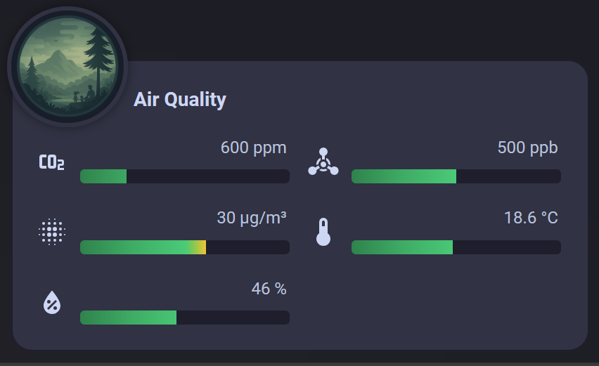
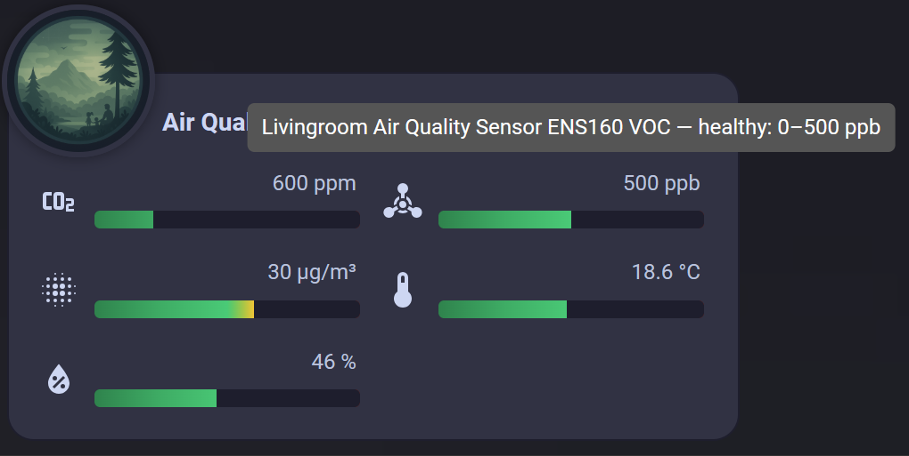
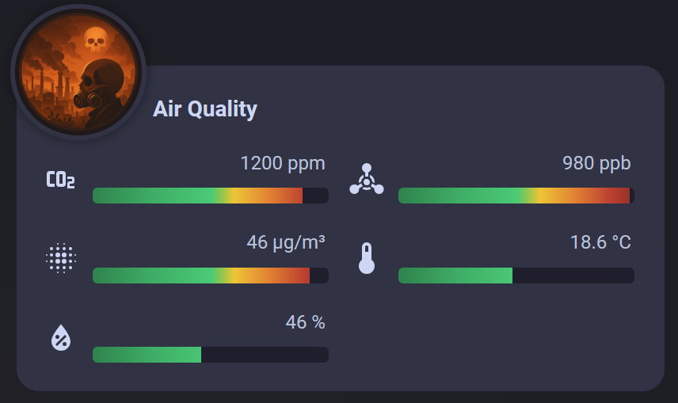

# Air-Quality-Card
INSPIRED BY THE FLOWER CARD BY Olen, check his repository (https://github.com/Olen/lovelace-flower-card)


A custom Lovelace card for Home Assistant to display air quality data with healthy ranges.

## Installation (via HACS)

1. Go to HACS → Frontend → Menu (top right) → Custom Repositories
2. Add this repository URL:
https://github.com/UrbanTechIO/air-quality-card
Type: Lovelace

3. Search for **Air Quality Card** in HACS and install
4. Add the following resource to your dashboard:

```yaml
url: /hacsfiles/air-quality-card/air-quality-card.js
type: module
```

# Usage

```yaml
type: custom:air-quality-card
title: Air Quality
entities:
  co2: sensor.your_co2
  voc: sensor.your_voc
  pm25: sensor.your_pm25
  temperature: sensor.your_temp
  humidity: sensor.your_humidity
  rating: sensor.your_rating
```

  - OR you may use the UI for picking the entities
  - You may leave the Absolute MAX and MIN empty for predefined ranges or change them to what you like.
  - Hoovering over the bars will reveal the name of the entity as well as the healthy range expected.
  - copy the images inside img directory to the directory www/airquality/
  - an entity that provide Air Quality Rating is a Must for the image to take effect with (unhealthy, poor, moderate, good, excellent) values.

  
  
  


  
